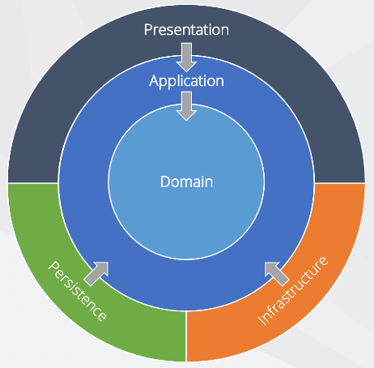

# poc-domain-driven-design

As you can see from the diagram:

- The Infrastructure layer depends on Applicaton and Domain Layer.
- The Application Layer depends only on the Domain Layer.
- The Domain layer has no dependencies on any layer.

### Repository Interfaces

Since repository interfaces deal with aggregates, the definition of these interfaces should reside in the Domain Layer, however their implementation should reside in the Infra Layer.

### Messaging Interfaces

As it stands now, the actual implementation of a consumer and a publisher should reside in the Infra Layer, such as technical details that have to do with RabbitMQ or Kafka, etc. However their interfaces should reside in the Application Layer because they are defining contracts for external interactions and application workflows.

### External API Client Interfaces

It depends. If the external API is closely tied to the domain, and they act almost as they are repositories, then you put their interfaces in the Domain Layer. However I think it makes sense to put the interface in the Application layer when the data retrieved does not have to do with the domain.
